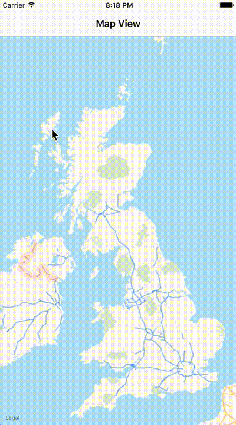

# UdactityVirtualTourist
Demo iOS app showcasing an interactive map view.

- Using UIkit's custom presentation machinery for modal display of location photos
- Location photos retrieved async from flickr Rest API
- User Data store persistently using Core Data
- Swinject for dependency management

